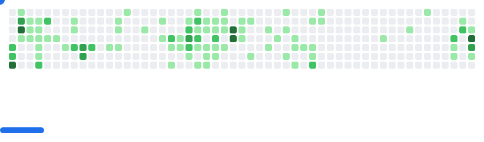

## Marquinhos CF 😁

  
<h3>:man_student: About me</h3>

  
Software Engineer with a background in Control and Automation Engineering, with solid knowledge in modeling and control of dynamic systems, industrial informatics, industrial robotics, embedded systems development in C++, and data science with Python.

  
Experience as a Full Stack Developer (front-end and back-end), working with JavaScript, React, NodeJS, Angular, Java, Spring Boot, Play, Python, Django, Dart & Flutter (mobile), databases (MySQL, PostgreSQL, Oracle), Linux, Docker, Unit Testing, Tailwind, Bootstrap, CSS, and HTML.

  
   
  
  
  

    

  

    <h3>:toolbox: Languages and Tools</h3>
  

  <h3>👨‍💻 Programming and Markup Languages</h3>
  
  
  
  
  
  

  
  
  
  
  
  
  
  
  
  

    

  

    <a href="https://github.com/MarquinhoCF">
    
  

  <picture>
    <source media="(prefers-color-scheme: dark)" srcset="images/breakout-dark.svg">
    <source media="(prefers-color-scheme: light)" srcset="images/breakout-light.svg">
    
  </picture>
  

  

  

    <h3>🌐 My social networks</h3>
  

  
 
    
    
    
     
  

   

